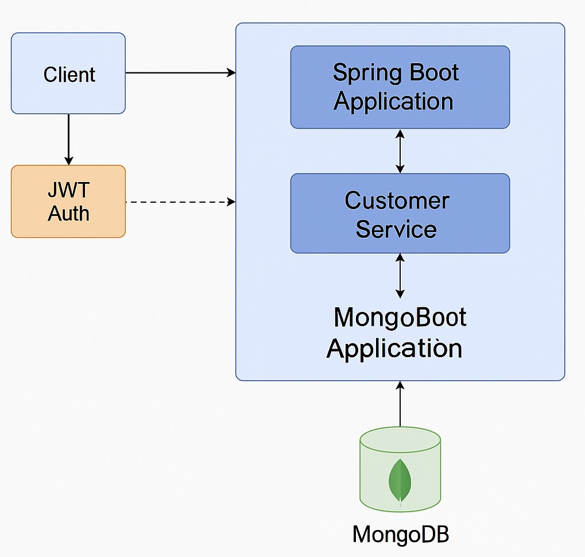

# Secure API Orchestration Demo

This is a Spring Boot 3.x demo application that showcases secure, modular API orchestration using:
	•	JWT-based authentication
	•	MongoDB for data persistence
	•	Kafka for asynchronous event-driven workflows
	•	Role-based access control
	•	Swagger UI for API visualization

The project models a real-world orchestration pattern for secure customer management APIs, demonstrating how modern backend systems can balance security, asynchronicity, and developer clarity.

---
## Overview

The application demonstrates a production-style secure API orchestration system built with Spring Boot.
It features JWT-secured endpoints, event-driven communication via Kafka, and role-based user access to simulate enterprise-grade workflows.

Key Objectives:
	•	Implement token-based authentication with JWT
	•	Provide modular and extensible API orchestration logic
	•	Showcase async event handling with Kafka producers and consumers
	•	Enable quick API exploration through Swagger and Postman

⸻
## Architecture Diagram


## Tech Stack

|    Layer 	   |      Technology               |     Purpose    |
|--------------|-------------------------------|----------------|
| **Backend**  | Java 17, Spring Boot 3.x      | Core orchestration logic |
| **Security** | Spring Security, JWT (JJWT)   | Authentication & authorization |
| **Database** | MongoDB                       | Data persistence |
| **Messaging** | Kafka                        | Event-driven workflows |
| **API Docs** | OpenAPI / Swagger UI          | Interactive API documentation |

---

## Features

- Secure login to generate JWT tokens
- Protected endpoints with Bearer token authentication
- CRUD operations for Customer entities
- Kafka-based event publication (customer.created)
- Swagger UI integration for API discovery
- Modular design for extensibility across microservices

---
## API Endpoints

### Authentication

| Method | Endpoint         | Description                       |
|--------|------------------|-----------------------------------|
| POST   | `/auth/login`    | Login with JSON body              |
|        |                  | `{ "username": "test", "password": "test123" }` |

> Returns a JWT token. Use it in the `Authorization` header as `Bearer <token>`.

---

### 👤 Customers

All endpoints below require a valid Bearer token in the `Authorization` header.

| Method | Endpoint               | Description               |
|--------|------------------------|---------------------------|
| GET    | `/api/customers`       | Get all customers         |
| GET    | `/api/customers/{id}`  | Get customer by ID        |
| POST   | `/api/customers`       | Create new customer       |
| DELETE | `/api/customers/{id}`  | Delete customer by ID     |

> Sample `POST` body for creating a customer:

```json
{
  "firstName": "Hitaishi",
  "lastName": "N",
  "email": "test@example.com",
  "phone": "9876543210",
  "status": "ACTIVE"
}
```

### Kafka Integration

Kafka is used to publish customer.created events asynchronously after a customer is saved.

Topic: customer.created

Producer: Publishes event from customer service

Consumer (optional): Reacts to event (e.g., sends email, logs audit, etc.)

Sample Code:

```
@Autowired
private KafkaTemplate<String, String> kafkaTemplate;

public void publishCustomerCreatedEvent(Customer customer) {
    String json = new Gson().toJson(customer);
    kafkaTemplate.send("customer.created", json);
}
```
### Sample Login Credentials
{
  "username": "test",
  "password": "test123"
}

### Swagger UI
http://localhost:8080/swagger-ui/index.html

### Docker (Optional)

If Docker is installed:
docker-compose up

Ensure docker and docker-compose are installed and MongoDB container runs successfully.

### Postman Collection

A ready-to-import Postman collection is available in the repo:
secure-api-orchestration-demo.postman_collection.json

## Getting Started

### 1. Prerequisites

- Java 17
- Maven
- MongoDB (running on `localhost:27017`)
- (Optional) Docker & Docker Compose

---

### 2. Clone the Repository

```bash
git clone https://github.com/hitaishin-17/secure-api-orchestration-demo.git
cd secure-api-orchestration-demo

### Setup & Run

Option A: Run from IntelliJ
	•	Open project
	•	Run SecureApiOrchestrationApp.java

⸻

### Contributing

Feel free to fork, suggest improvements, or raise issues.

⸻
### About This Build
I’m Hitaishi N, a backend engineer focused on secure API architectures and event-driven system design.
This demo models how to build production-grade orchestration logic with Spring Boot, JWT, and Kafka, while maintaining clean modularity and low-latency performance.
The goal: to showcase how scalable and secure backend systems can be designed with clarity, reusability, and simplicity.

[Connect on LinkedIn](www.linkedin.com/in/hitaishi-n-grovista)


